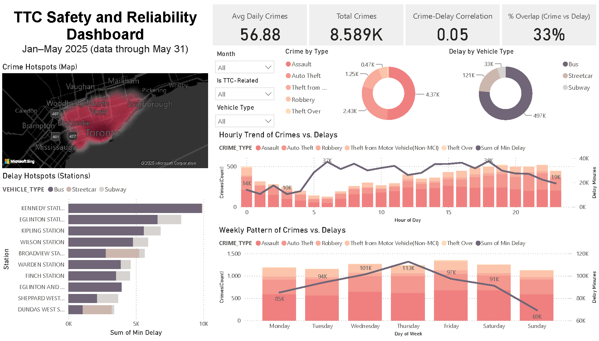

# Table of Contents

- [Introduction](#introduction)
- [Key Business Questions](#key-business-questions)
- [Key Findings](#key-findings)
- [Data Source](#data-source)
- [Technologies Used](#technologies-used)
- [Methodology](#methodology)
- [Dashboard Design](#dashboard-design)

# Introduction

Following a personal experience with a TTC subway service disruption, I became interested in understanding the extent to which **crime impacts transit reliability in Toronto**.  
To investigate this, I developed an **interactive TTC Safety and Reliability Dashboard** that integrates **crime data** with **service delay data** to provide actionable insights.

#### Dashboard Value

##### Riders
- Gain awareness of when and where risks are most significant  
- Make safer and better-informed travel decisions  

##### TTC Operations
- Identify hotspots where **incidents and delays overlap**  
- Allocate resources more efficiently  

##### City Planners & Policymakers
- Monitor long-term trends by time, location, and incident type  
- Support evidence-based policy and infrastructure planning  

## Objective

The objective of this project is to provide a **data-driven perspective** on how **safety and reliability intersect** across Toronto’s transit system—moving beyond anecdotal experiences to support **safer travel, operational efficiency, and informed decision-making**.

# Key Business Questions

| **Business Questions**                          | **Supporting Visuals**                          |
|-------------------------------------------------|-------------------------------------------------|
| Where are crime hotspots?                       | Crime Hotspots (Map)                            |
| Where are delay hotspots?                       | Delay Hotspots (Stations)                       |
| When do incidents spike by hour of day?         | Hourly Trend of Crimes vs. Delays               |
| When do incidents spike by day of week?         | Weekly Pattern of Crimes vs. Delays             |
| Do crime hotspots align with service issues?    | - Crime–Delay Correlation   - % Overlap (Crime vs. Delay) |

# Key Findings

- **Where are crime hotspots?**  
  - Highest concentration in **downtown Toronto and North York**.  
  - Crime is unevenly distributed, with central neighbourhoods showing higher incident rates.  

- **Where are delay hotspots?**  
  - Most impacted stations: **Kennedy, Eglinton, and Kipling**.  
  - Subway delays dominate overall; bus and streetcar delays are concentrated in fewer locations.  

- **When do incidents spike by hour of day?**  
  - Crimes remain steady across the day, rising in the **late evening**.  
  - Delays peak in the **morning and evening commute periods**, partially overlapping with crime activity.  

- **When do incidents spike by day of week?**  
  - **Wednesday and Thursday** show the highest combined levels of crime and delays.  
  - **Sunday** reports the lowest levels, likely due to reduced transit usage and activity.  

- **Do crime hotspots align with service issues?**  
  - KPI cards show *Crime–Delay Correlation* (**0.05 overall**, higher for TTC-related events).  
  - % Overlap indicates **around one-third of hours** have both above-average crime and delay.  
  - Stronger correlation appears for TTC-related crimes, especially on **bus routes**.  

### Other Key Findings

- **Downtown Toronto** and **major transfer hubs** are primary risk areas.  
- Delay issues are concentrated at a **small number of high-traffic subway stations**.  
- Crimes spread more evenly through the day, while delays follow **predictable rush-hour patterns**.  
- **Wednesday and Thursday** are the riskiest days for combined service and safety issues.  
- Overall crime–delay alignment is weak, but **overlap is significant (30–40%)**, meaning hotspots can coincide with service reliability issues.  

# Data Source

### Crime Data

| **Crime Type** | **File Name** | **URL** |
|----------------|---------------|---------|
| Assault        | Assault_Open_Data_6843660120719629610.csv | [Link](https://data.torontopolice.on.ca/datasets/b4d0398d37eb4aa184065ed625ddb922_0/explore) |
| Robbery        | Robbery_Open_Data_290825605172193961.csv  | [Link](https://data.torontopolice.on.ca/datasets/TorontoPS::robbery-open-data/about) |
| Theft Over     | Auto_Theft_Open_Data_-63738008209735817.csv | [Link](https://data.torontopolice.on.ca/datasets/TorontoPS::auto-theft-open-data/explore) |
| Theft Under    | Theft_From_Motor_Vehicle_Open_Data_4956303216963570128.csv | [Link](https://data.torontopolice.on.ca/datasets/theft-from-motor-vehicle-open-data/explore) |

### Delay Data

| **Vehicle Type** | **File Name**                        | **URL** |
|------------------|---------------------------------------|---------|
| Bus              | TTC Bus Delay Data since 2025.csv     | [Link](https://ckan0.cf.opendata.inter.prod-toronto.ca/en/dataset/ttc-bus-delay-data/resource/c3451ac9-c04a-4645-bd80-0e2a3b7d7199) |
| Streetcar        | TTC Streetcar Delay Data since 2025.csv | [Link](https://ckan0.cf.opendata.inter.prod-toronto.ca/id/dataset/ttc-streetcar-delay-data/resource/7d545629-745c-4fbf-a348-76692bb2772d?view_id=25ff42c4-ab58-4760-8355-7afb45c42e02) |
| Subway           | TTC Subway Delay Data since 2025.csv  | [Link](https://ckan0.cf.opendata.inter.prod-toronto.ca/dataset/ttc-subway-delay-data/resource/6088e14f-e46e-4f5c-9daa-dea1359ad396) |

# Technologies Used

| **Technology**        | **Purpose**                                      |
|------------------------|--------------------------------------------------|
| `CSV`                    | Raw data storage and integration format          |
| `Python (GeoPandas, Pandas)` | Data preprocessing, and geospatial analysis |
| `Power Query`            | Data transformation and cleaning                 |
| `Power BI`               | Dashboard design, data modeling, and visualization |
| `DAX (Power BI)`         | Calculated measures and KPIs                     |

# Methodology

### Data Cleaning
- Removed nulls, duplicates, and irrelevant records  
- Standardized date/time into **Day of Week, Hour of Day, and Month**  
- Normalized categories (e.g., vehicle type, crime type)  
- Filtered scope to **Toronto incidents from Jan–May 2025**  
- Identified key columns for analysis and dropped unused fields  

### Data Merge
- Appended all crime datasets into one table  
- Appended all delay datasets into one table  
- Joined the two on temporal keys (**Day of Week, Hour of Day**)  
- Connected **Crime Data (OCC_DOW, OCC_HOD)** with **Delay Data (DOW, Hour)**  
- Mapped crime neighbourhoods and TTC stations into comparable geographies for hotspot analysis  
- Configured relationships between datasets in Power BI for consistent aggregation  

### Analysis Approach
- Engineered new features (e.g., *Is TTC Related*, Day of Week, Hour of Day)  
- Created measures for crime counts, average daily incidents, and total delay minutes  
- Built KPIs: **Crime–Delay Correlation** and **% Overlap** (high-crime & high-delay hours)  
- Developed slicers for **Month, TTC-Related, Vehicle Type, Premise Type**  
- Designed visuals by **geography (map, stations), time (hour, day), and category (crime type, vehicle)**  

# Dashboard Design

- **KPIs on top for instant insights**  
  - Avg Daily Crimes  
  - Total Crimes  
  - Crime–Delay Correlation (HOD)  
  - % Overlap (Crime vs. Delay)  

- **Left Panel: WHERE**  
  - Heatmap of neighbourhood crime density  
  - Bar chart ranking delay hotspots by station (stacked by vehicle type)  

- **Right Panel: WHAT / WHEN**  
  - Donuts for crime type and delay by vehicle  
  - Combo charts: hourly & weekly crimes (bars) vs. delay minutes (line)  

- **Filters (near KPIs, apply to all visuals)**  
  - Month  
  - Is-TTC-Related  
  - Vehicle Type  

